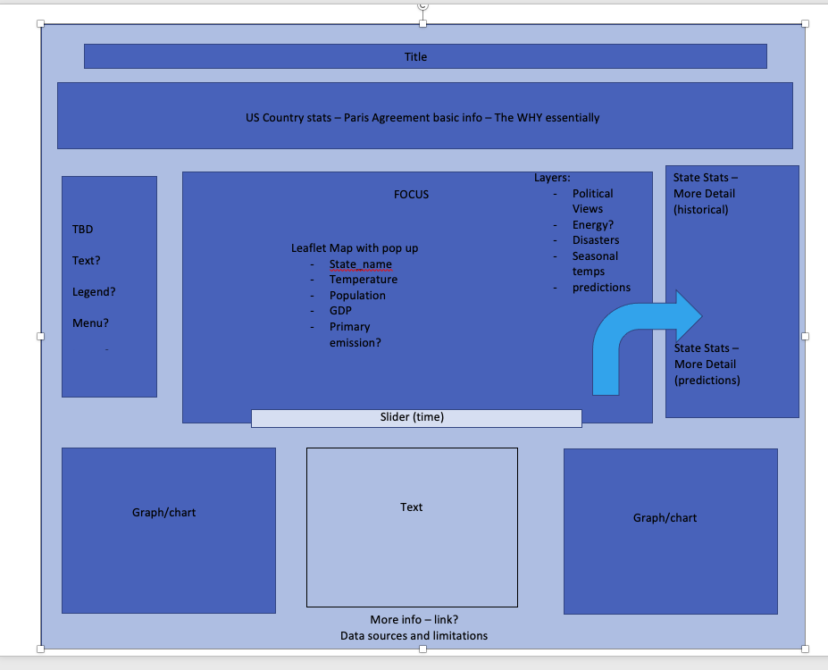
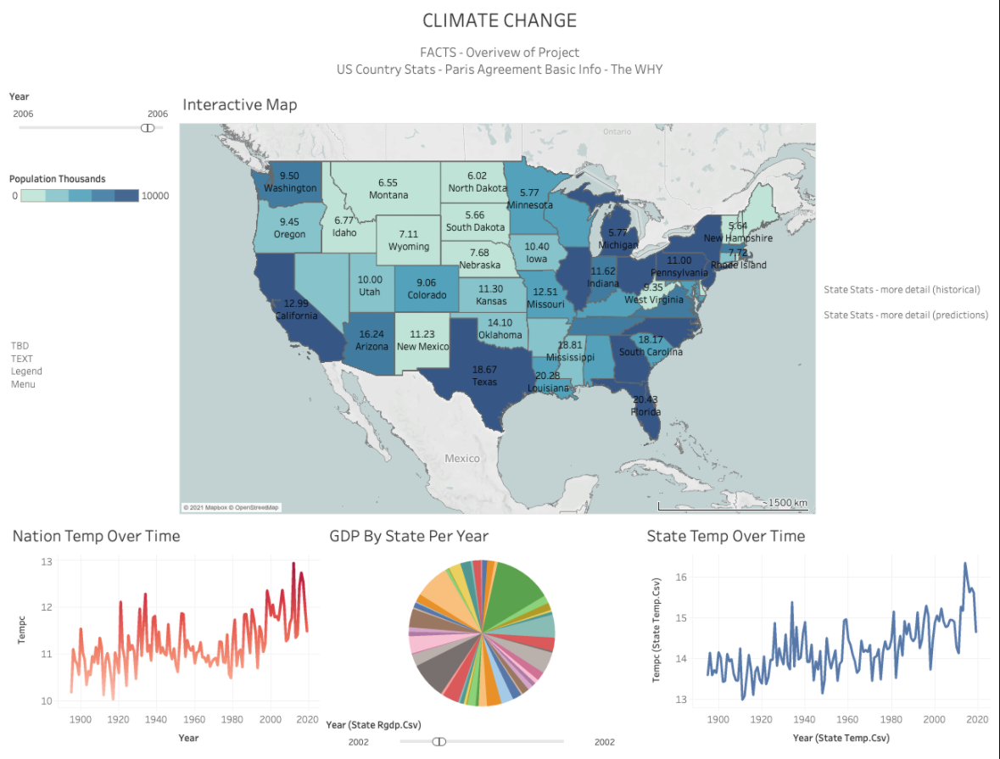

# Visualizations

## Our Story

We wanted to gain insight on climate change in the United States. We are interested to know if we quantify the human impact on climate change in the USA. In addition, we want to know if states are experiencing climate change equally and if some states are influencing climate change more than others.  

## Presentation Slides and Script:
 - <a href="https://docs.google.com/presentation/d/15MENIOhjLSVF9AC3xavduDZ4B1AA4qlJFtM7gXTUJPA/edit#slide=id.p">Climate Trends Slides</a>
 - <a href="https://docs.google.com/document/d/17QTFpMqb2Hr_oPxPhpX2MKCEbhAhqKD2b9tUgRSGlSM/edit?usp=sharing">Presentation Script</a>

## Primary Responsibilities:
 Stephanie and Irene

1. Team discussed what elements we would like to include on dashboard (if possible)
    - Interactive Map (focus) with slider for time
    - "Baseball Card"
    - US Summary/Purpose
    - graphs (2-3) - Based on Findings
    - filters
    - layers

2. Created Blueprint
</img>

3. Created mock dashboard on Tableau with placeholder images
</img>

4. Created skeleton for JS Web Dashboard if data/group decides to use

5. Created combined_features_PCA3_K5.csv with all features included and totals for Primary Energy and Disaster Columns for visualization.

6. Updated file to be used for visualizations "combined_features.csv" to read

7. Decided to use Tableau because Tableau provides a variety of graphs and charts. It provides a lot of features such as layers and filters that we want to utilize in order to best visual our results. It suits our needs of the project to be able to easily combine geographical (mapped) data with charts of our feature variables.

8. Decided to make a webpage using HTML, CSS, and Javascript to better convey our story and enhance user experience.

## Dashboard Descriptions and Tableau Links

### Irene:
- The dashboard below showcases the climate change trends in the United States over time. The graphs highlight the features; location, population, CO2 emissions, GDP, natural disasters, energy consumption, and renewable energy that a help predict temperature. Based on our machine learning model and accuracy, we have found that location and geographical features are key indicators in predicting temperature. On the other hand, features like natural disasters has little to no effect on temperature. The interactive map clearly shows that states closer to the equator are warmer in comparison to those that are further away. 

    <a href="https://public.tableau.com/profile/irene.depacina#!/vizhome/ClimateChangeTrends_16174174601980/Dashboard1?publish=yes">Climate Trends Overall</a>

- The dashboard below showcases a breakdown of features based on the state. The purpose of the analysis is to discover if some states are exacerbating climate climate based on human impact. The dashboard enables users to compare states against each other. Users can compare CO2 emissions, average temperature, energy usage, and natural disasters. 

    <a href="https://public.tableau.com/profile/irene.depacina#!/vizhome/ResultsbyState/Dashboard1">Climate Trends by State</a>

### Stephanie:
#### Classes ####
- The below dashboard focuses on the clusters/classes defined in our unsupervised machine learning model. The map shows the class by colour and when the user hovers over a state, the details for all features used are available for that state. There are the minimum, maximum and averages tables for all features beside the  map. When a user clicks on their state, the minimum, maximum and average values of their class are highlighted on the side for comparison. Population size is visually represented by the size of the circle. Time is accounted for by playback feature. 

    <a href="https://public.tableau.com/profile/stephanie.m.juniper#!/vizhome/Climate_Change_Classes/ClusterTrends?publish=yes">Climate Trends by Class</a>
- This dashboard is an accessory to the above Clusters/Classes dashboard. It provides a more detailed look into the types and quantities of renewable and non renewable energies used in each class. The user is able to click through or select the classes they wish to inspect and the pie charts will adjust accordingly.

    <a href="https://public.tableau.com/profile/stephanie.m.juniper#!/vizhome/Climate_Change_Classes/EnergyusebyCluster">Energy Use by Class</a>

#### Key Findings ####
- The Temperature Key Findings dashboard provides high-level insight into the temperature trends by State over time and our key findings from our analysis. The user can choose the year they wish to see or roll the scroll bar to see changes over time.

    <a href="https://public.tableau.com/profile/stephanie.m.juniper#!/vizhome/Temp_CO2_highlights/Temp_Key_Findings">Temperature Key Findings</a>

- The CO2 Key Findings Dashboard is very similar to the temperature dashboard, as it visualizes CO2 Emissions by State over time. The board also illustrates a comparison of renewable and non renewable energy consumption over time by state.

    <a href="https://public.tableau.com/profile/stephanie.m.juniper#!/vizhome/Temp_CO2_highlights/CO2_Key_Findings">CO2 Emissions Key Findings</a>

#### Machine Learning and Predictions ####
- The below dashboards illustrate our Supervised ML models and why CO2 is a better target variable compared to temperature. 

    <a href="https://public.tableau.com/profile/stephanie.m.juniper#!/vizhome/Predictions_16178534877910/NN-SKLModels">Temperature Predictions</a>

    <a href ="https://public.tableau.com/profile/stephanie.m.juniper#!/vizhome/Predictions_16178534877910/FeatureModels">Temperature Key Features</a>

    <a href="https://public.tableau.com/profile/stephanie.m.juniper#!/vizhome/Predictions_16178534877910/CO2Model">CO2 Predictions</a>

## Webpage

- Used HTML, CSS, and Javacript to create a webpage
- We used a combined csv file that included all of our features.
- The webpage is divided into 7 sections:
    - Climate Trends
    - Temperature Findings
    - CO2 Emissions Findings
    - Our Model
    - Predictions and Accuracy
    - Energy Consumption
    - State Comparison
    - Energy Use per Capita
    - Conclusions/Key Takeaways
- The structure of the webpage is to showcase the biggest takeaways in less detail first and work towards explaining the lower importance facts in more detail.
- The webpage highlights all of the findings from the climate change datasets and machine learning model. The findings are visualized in a manner that is honest and easily accessible. The dashboards enables users to see trends and statistics based on selected years, states, and clusters. 
- The dashboards include filters and animations to enable users to see changes over time and gain insight on selected features, states, and clusters.
- Our webpage can be found in the link provided giving useres the opportunity to see our findings, trends, and compare states and clusters.

    <a href="https://irenedepacina.github.io/predicting_temp/">Climate Change Webpage</a>

