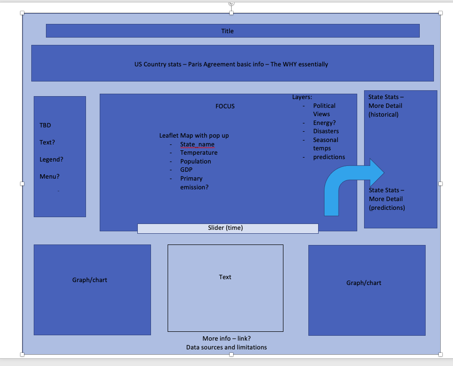

# Dashboard priorities and progress

 Stephanie and Irene
1. Team discussed what elements we would like to include on dashboard (if possible)
    - Map (focus)
    - "Baseball Card"
    - US Summary/Purpose
    - graphs (2-3) - Based on Findings
2. Created Blueprint
</img>

3. Created mock dashboard on Tableau with placeholder images
</img>
4. Created skeleton for JS Web Dashboard if data/group decides to use
5. Created 
combined_features_PCA3_K5.csv with all features included and totals for Primary Energy and Disaster Columns for visualization.
