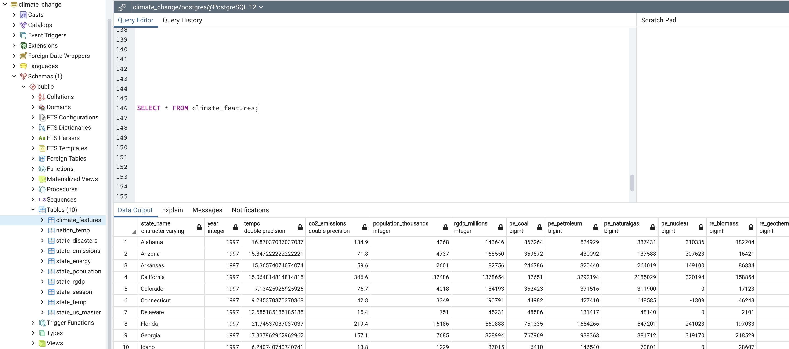

# Climate change by State in the USA
- Datasets collected to analyse climate change in the US as described in Data_Processing, are all primarily .csv files.
- Hence it was decided to use Postgres DB using SQL and pgAdmin.

## Database Design and ERD
- Based on the datasets collected, tables to hold the data were designed.
- Main factors while collecting the data were 
    - the data should be available for all the 48 states of USA (all states on mainland)
    - the data should be available for atleast a 20 to 25yr period
- Main features considered for analysing the climate change are 
    - temperature (in each US states each year) 
    - CO2 emissions 
    - energy consumption by primary sources (coal, petroleum, naturalgas, nuclear) and renewable sources (biomass, geothermal, hydropower, solar, wind)
    - Real GDP
    - Population
    - Disasters encountered in various states (causing a damage of $1 billion)
    - Average temp for the nation as a whole over the period of time
    - Season temperature for each state (data not on time period but single row of data for each state)
- In PostgreSQL "climate_change" DB was created. Schema to hold all the above data was designed using QuickDBD, an ERD creation tool, <a href="https://github.com/irenedepacina/final_project/blob/develop/Database/erd_instructions.sql">script for ERD</a>.
- Based on the data analysis of all the datasets single common feature was identified to be state_name. Hence a master table was created with state_name serving as foreign key to rest of the tables and state_abbreviation fields
- ERD for the database holding all the datasets collected for analysis is as shown below with "state_us_master" designed as master table. 
- </img>

## Data Load
- All 9 tables were created with identified primary key and foreign key using the SQL scripts in <a href="https://github.com/irenedepacina/final_project/blob/develop/Database/Climate_Schema.sql">Climate_Schema.sql</a> file.
- <a href="https://github.com/irenedepacina/final_project/blob/develop/Data_Processing/ETL_create_database.ipynb">Data processing .ipynb script</a> was created using python pandas to connect to database "climate_change" and load all the tables with <a href="https://github.com/irenedepacina/final_project/tree/develop/Resources/data_processed">data processed .csv files</a>.
- As all the features required to analyse climate, were spread across 9 tables, <a href="https://github.com/irenedepacina/final_project/blob/develop/Database/Climate_features_Query_df.sql">SQL query using "join"</a> was designed to consolidate all the features into 1 single table "climate_features" with data for desired time period of 1997 to 2018 (22yrs of data).
- </img>
- The climate_features table is the consolidated view table which sources the data for analysis by connecting to climate_change DB using <a href="https://github.com/irenedepacina/final_project/tree/develop/Machine_Learning">Machine Learning Model scripts</a>.
---
---