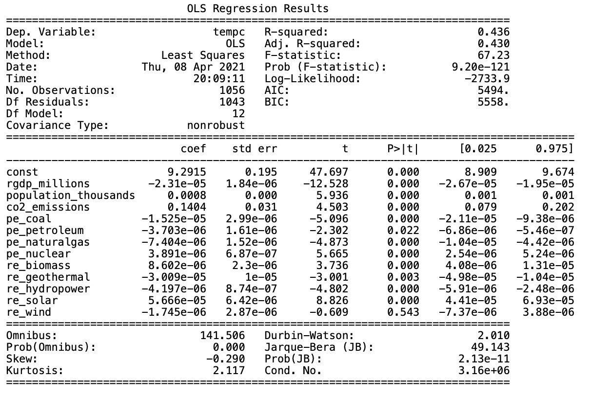

# Climate change by State in the USA
## Machine Learning Model :
- The dataset considered for this project is pertaining to climate change for the geographical location of a country "United States of America".
- The human interventions contributing to climate change are specifically considered along with other set of features like time and various states of US.
- Datasets were collected from various reliable websites in csv format and a thorough data preprocessing was done with all the details mentioned in <a href="https://github.com/irenedepacina/final_project/blob/develop/Data_Processing/README.md">Data_Processing --> README</a>.
- After the data was processed, features were selected for thorough analysis based on the understanding of the features and its likely contribution to climate change.
- Finalised Feature list for analysis are as follows :
    - state_name
    - year
    - temp
    - CO2_emissions
    - population_thousands
    - rgdp_millions
    - state_energy --> pe_coal, pe_naturalgas, pe_petroleum, pe_nuclear, re_biomass, re_geothermal, re_hydropower, re_solar, re_wind
    - state_disasters --> drought, flooding, freeze, severe_storm, tropical_cyclone, wildfire, winter_storm
- As this dataset has lot of potential to be explored to understand the clusters of data, Unsupervised Machine learning model was employed.
- Post Unsupervised ML, it was determined that temp, CO2, year, state, disasters of a state could be considered as potential targets for supervised ML with rest supplied as features.  

# Unsupervised Machine Learning model
- All the features were taken into the "climate_features_df" by connecting to "climate_change" PostgreSQL DB.
- The data was observed to range from a "xx.xxxxxx" float temp in celsius values to population in thousands to rgdp in millions.
- Thus StandardScaler from sklearn library was used to  transform the dataset before using machine learning algorithm. 
- To start with, Principal Component Analysis (PCA) was implemented to figure out the most optimum number of principal components for this dataset. 3 PCs were determined to be the optimum and the best explained_variance_ratio_ = 71% was achieved for the 3 principal components identified. Unsupervised ML summary table below has all the details of the combinations.
- </img>
- Elbow curve was plotted to figure out the optimum number of clusters for the dataset. As there is a good enough elbow bend at 4, # of clusters was determined to be 4 for the best PCA feature combination.
- </img>
- KMeans algorithm was run to break the dataset into 4 different cluster classes.
- The output of the Unsupervised Machine learning model was saved into a csv file as "Unsupervised_ML_output.csv".
- This data with the labeled cluster classes was analysed to understand the feature category falling into each cluster.
- </img>

# Supervised Machine Learning model
- Completing exploratory analysis of the climate change dataset using Unsupervised machine learning, it was observed that the features tempC, co2_emissions, population, rgdp, 9 of the energy consumption features explain most of the % of variance.
- To start with supervised ML, tempC and CO2_emissions were considered to be potential targets.
- Pairplots were plotted to understand the relationship of rest of the features with the targets.
- OneHotEncoder was used to convert the state_name categorical feature to numerical data so that it can be used in ML algorithm.
### X, y - Train, Test splits - Data transformation 
- X and Y split was performed to separate the target variable as "y" and rest of the features as "X".
- Both X and y were split into train and test sets using train_test_split of sklearn.model_selection library. This is mainly to fit the model using the training set and then evaluate the model using test data. 
- StandardScaler from sklearn library was used to transform the X_train and X_test dataset. No scaling needed for the y_train and y_test as "y" is the target value that has to be predicted by the model.
- As the target selected tempC is a continuous numerical data with multiple features supplied as inputs, multiple linear regression was selected as the model.
### Deep Neural Network - Multiple Linear Regression model
- Deep neural network was used to implement the multiple linear regression to predict the tempC as target and accepting all other features state, year, co2_emissions, population, rgdp, all 9 energy consumption features. Deep NN was designed using TensorFlow.Keras.Sequential model with 4 hidden layers having activation function as "relu". Output layer with 1 output and activation function as "linear". Number of neurons ranging from 150 (almost 2.5 times the number_of_inputs= 61 including the 48 states as numerical data) on the 1st hidden layer to 50 on the 4th hidden layer. Optimizer for the model was selected to be "adam".
- As it is multiple linear regression model accuracy metrics was selected to be "root mean squared error". 
- Number of epochs was selected to be 500 and the model was fitted with X_train_scaled and y_train datasets.
- Accuracy score of RMSE = 78.40% was achieved.
### SKLearn - Multiple Linear Regression model
- As the resources used in the DNN is way too many and expensive compared to other supervised ML model, "sklearn multiple linear regression" model was tried with the same set of X and y datasets. 
- After the model was fitted using X_train_scaled and y_train, the y meaning tempC was predicted using X_test_scaled.
- Accuracy score of R-Squared = 97.63% was calculated using the y_test and y_predicted.
### Confounding features & features behaving as proxies for US states
- In depth analysis of the features and running the machine learning model for various combinations like predicting tempC with just state, year having a near perfect R-squared of 97.55, led to the inference that the dataset has confounding features and some of the features of the dataset are behaving as proxies for US states. Statistically, this causes spurious association. 
- Considering the above observations, a model was built to predict tempC based on only the human impact features CO2_emissions, population, rgdp, 9 energy consumption features. The R-Squared for this model was found to be 43.68%.
- This model was taken up for further indepth statistical analysis using different data transformation techniques.

### Statsmodels and SK Learn: Multiple Linear Regression 

#### Data Transformation
- A logarithmic transformation was applied to the data to reduce the variability as well as the skewness of several variables such as real GDP measured in millions of dollars, population in thousands, CO2 emissions in million metric tons, and energy consumption by source in billion BTU. 
- The log transformation also improved the linear relationship between the target variable and each of the features. 
- Unlike the Yeo-Johnson Power transformation that was initially applied, logarithm transformations improved model fit without compromising the interpretability of the model. In fact, when the target and n number of features were logged transformed, each estimated slope coefficient in the multiple linear regression was interpreted as the average percent change in the target variable that is associated with a one percent change in the nth feature while holding all the other features constant. 

#### Results

    <strong> Model 1 </strong>  
    

- After fitting the initial model on untransformed data, it was found that 43.6% of the variation in temperature was associated with variation in real GDP, population, CO2 emissions and several energy consumption levels by source. 

    <strong> Model 2 </strong>  
    

- After fitting the linear model on log transformed data, the R-squared improved to 54.7%. It would seem that more than half of the variation in logged temperature was explained by the variation in log transformed human-related features.
- However, further analysis revealed that this relationship was confounded by state name. 
- Firtsly, the human-related features were able to predict the state name with 98.48% accuracy using just a simple neural network consisting of a single hidden layer of 100 nodes. This implies that state_name has a great influence on GDP, population, CO2 emission and energy consumption. It is reasonbable to believe that location contains unique features like demographics and information about the local economy which influence these human-related features. 
- Secondly, regressing temperature on state name revealed that these two variables were highly correlated with each other. This correlation was largely driven by how location contains geographical and climate features that greatly influence temperature.
- Since, state name influences both the target (temperature) and the human-related features, it can be concluded that this regression is spurious. 

    <strong> Model 3 </strong>  
    

- Given the spurious relationship of the previous linear model, the target was switched to log_co2_emissions instead. 
- CO2 emissions is highly correlated with temperature. A state can indirectly associate the impact of its population, real GDP and energy consumption patterns with rising average annual temperature through the CO2 emissions that it produces. 
- Temperature, nuclear energy and geothermal energy consumption were dropped from the model since they were not statistically significant at a 5% significance level.
- About 93% of the variation in the log_co2_emissions is explained by the variation in the logged transformed real GDP, population and energy consumption levels by source. 
- On average, a 1% increase in real GDP is associated with a -0.3398% change in CO2 emissions holding all the other variables constant.
- On average, a 1% increase in population is associated with a 0.3750% change in CO2 emissions holding all the other variables constant.
- On average, a 1% increase in coal energy consumption is associated with a 0.0676% change in CO2 emissions while holding all the other variables constant.
- On average, a 1% increase in petroleum energy consumption is associated with a 0.6334% change in CO2 emissions holding all the other variables constant.
- On average, a 1% increase in natural gas energy consumption is associated with a 0.2510% change in CO2 emissions while holding all the other variables constant.
- On average, a 1% increase in biomass energy consumption is associated with a -0.0920% change in CO2 emissions while holding all the other variables constant.
- On average, a 1% increase in hydropower energy consumption is associated with a 0.0109% change in CO2 emissions while holding all the other variables constant.
- On average, a 1% increase in solar energy consumption is associated with a -0.0224% change in CO2 emissions while holding all the other variables constant.
- On average, a 1% increase in wind energy consumption is associated with a 0.0059% change in CO2 emissions while holding all the other variables constant.

#### Key takeaways
- A model that solely uses human-related features to predict climate change measured  in average annual state temperature is not accurate. This is due to lurking variables such as location which influence both temperature and human-related features such as population, GDP, and energy consumption patterns. 
- We can create a model that quantifies the impact of a state's energy consumption pattern on CO2 emissions, the main culprit of rising temperatures. 
- Energy consumption from non-renewable sources contribute to increasing CO2 emissions since coal, petroleum, and natural gas all had statistically significant positive slope coefficients. 
- Energy consumption from renewable sources  either reduce CO2 emissions or contribute a negligible amount to it since biomass, hydropower, solar and wind all had statistically significant negative or close to zero slope coefficients. 
- The magnitude of the point estimates of the slope coefficents of the renewable energies were smaller than that of nonrenewable energies. This implies that consuming energy from biomass, hydropower, solar and wind does not reduce CO2 emissions by the same amount that energy consumption from coal, petroleum and natuaral gas increases it. 

---
---