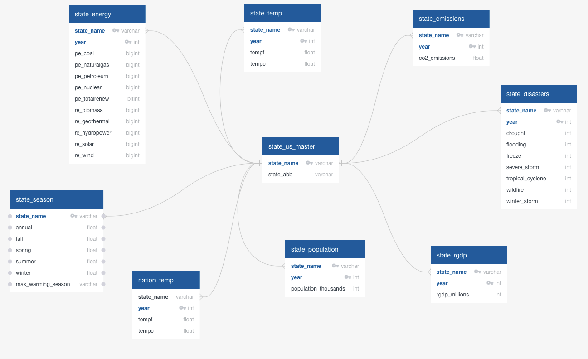

# Climate Change Group Project

## Team 
- Irene 
- Sebastian
- Stephanie
- Vinutha

## Selected Topic
            "Climate change by State in the USA"

## Rationale
- Dataset availability
- US is one of the largest emitters of CO2 in developed countries.
- Population density and land mass lends itself to analysis
- Climate change is an interesting topic with lot of available data.

## Discovery Questions
- Climate Change (Temperature) trends over time by state
- State by state environmental impact
- Are states experiencing climate change equally?
- Human impact on the US on climate change?
- Are some states exacerbating climate change through consumption patterns?

## Data Sources:
- Setting out in search of climate change related datasets for US, ended up identifying some of the sites to have reliable datasets in csv format
- Saved these datasets into our repository under <a href="https://github.com/irenedepacina/final_project/tree/develop/Resources/data_raw">Resources/data_raw</a>.
- These datasets are from websites :
    - https://data.world/environmentdata/
    - https://www.eia.gov/
    - https://www.ncdc.noaa.gov/
- Please see <a href="https://github.com/irenedepacina/final_project/blob/develop/Data_Processing/README.md">Data_Processing --> README</a> for more details.
## Machine Learning
- Unsupervised Machine Learning performed as exploratory machine learning using Elbow curve, PCA & KMeans
- Multiple linear regression using SKLearn and Neural Network
- R Multiple linear regression models for detailed statistical analysis using various data transformation techniques
- Please see <a href="https://github.com/irenedepacina/final_project/blob/develop/Machine_Learning/README.md">Machine_Learning --> README</a> for more details.

## Database
- Postgres, SQL and PgAdmin
- Schema for the database holding all the datasets collected for analysis is as shown below with "state_us_master" designed as master table.

</img>

## Dashboard
- Tableau - Heroku Hybrid
- Please find presentation of our analysis on <a href="https://docs.google.com/presentation/d/15MENIOhjLSVF9AC3xavduDZ4B1AA4qlJFtM7gXTUJPA/edit#slide=id.p">Google Slides</a> here
- Please see <a href="https://github.com/irenedepacina/final_project/blob/develop/Dashboard/README.md">Dashboard --> README</a> for more details.